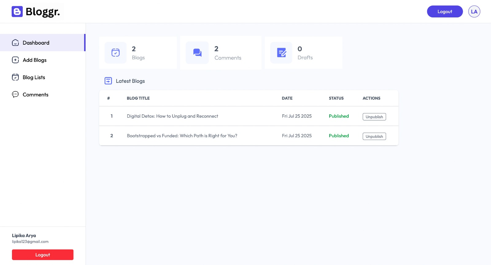
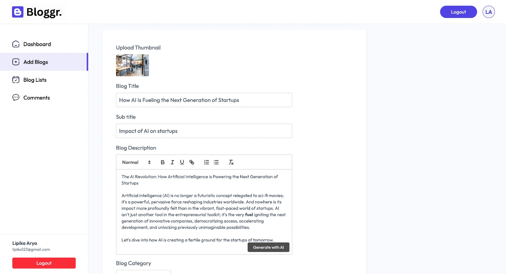

# ✍️ Bloggr

**Bloggr** is an AI-powered blogging platform built with the **MERN stack**, enabling users to create, manage, and publish blogs with ease. With AI-generated content, secure authentication, and admin-moderated comments, Bloggr offers a modern and intelligent blogging experience.


## 💻 Deployed App

👉 [Try it live!](https://bloggr-hub.vercel.app/)

## 📸 Preview

### 📌 Landing Page


### 📌 Dashboard


### 📌 Generate Blog


## 🛠️ Tech Stack

- **Frontend:** React, Tailwind CSS  
- **Backend:** Node.js, Express.js  
- **Database:** MongoDB (via MongoDB Atlas)  
- **Authentication:** JWT + Bcrypt  
- **AI Features:** Gemini API  
- **File Uploads:** Multer  
- **Image Hosting:** ImageKit  
               


## ✨ Features

- 🔐 **User Authentication** – Sign up and sign in securely with hashed passwords and JWT  
- 📝 **Create Blog Posts** – Write and publish your own blogs  
- 🤖 **AI-Powered Blog Writing** – Generate blog content using Google Gemini API  
- 💬 **Comments System** – Add comments on blogs; admins can approve or delete them  
- 📢 **Publish/Unpublish Blogs** – Control visibility of your posts  
- 📊 **Blogs Dashboard** – Manage all your posts and comments in one place


## 📦 Installation Guide

### ✅ Prerequisites

Ensure you have the following installed:

- **Node.js** (v18 or later) – [Download](https://nodejs.org/)
- **npm** or **yarn**
- **MongoDB Atlas account** – [Create one](https://www.mongodb.com/atlas)
- **ImageKit account** – [Sign up](https://imagekit.io/)
- **Gemini API access** – [Get it here](https://ai.google.dev/)


### ⚙️ Clone the Repository

```bash
git clone https://github.com/lipika1911/bloggr.git
cd bloggr
```

### 🔌 Install Dependencies

```bash
npm install
```

### 📝 Environment Variables

Create a .env file in client and server folders and configure the following:

**Client**
```env
VITE_BASE_URL = your_vite_base_url
```

**Server**
```env
PORT = your_port
MONGODB_URI = your_mongo_uri
JWT_SECRET = your_jwt_secret
GEMINI_API_KEY = your_gemini_api_key
IMAGEKIT_PUBLIC_KEY = your_imagekit_public_key
IMAGEKIT_PRIVATE_KEY = your_imagekit_private_key
IMAGEKIT_URL_ENDPOINT = your_imagekit_url
```

### 🏃 Run Backend

```bash
cd server
npm start
```

### 🏃 Run Frontend

```bash
cd client
npm run dev
```

### ✅ You’re all set!
- Open http://localhost:5173 in your browser.
- Register a new user and start using Bloggr!
## 📬 Contact

For feedback, ideas, or collaborations, reach out:

- 💻 **GitHub:** [lipika1911](https://github.com/lipika1911)

## 📄 License

This project is licensed under the [MIT License](./LICENSE).


## 👩‍💻 About the Developer

Made with ❤️ by [Lipika](https://github.com/lipika1911)
